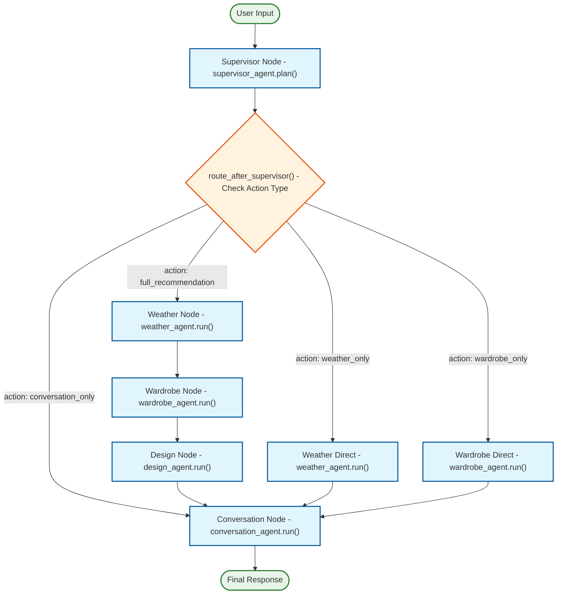

# Weather Outfit AI - Usage Guide

## Running the Application

### 1. Web Server (FastAPI)

Start the web server for API access:

```bash
python run.py web
```

The server will be available at:
- API: `http://localhost:8000`
- Documentation: `http://localhost:8000/docs`
- Health Check: `http://localhost:8000/health`

When running the web server multiple times, you might get an error indicating that the address is already in use. 
Run the following command to kill all current processes on the relevant port and restart the web server. 
```bash
sudo lsof -t -i tcp:8000 | xargs kill -9
python run.py web
```

### 2. Frontend (Streamlit UI)

Start the user-friendly web interface:

```bash
python run.py frontend
```

The frontend will be available at:
- Interface: `http://localhost:8501`

**Note**: Make sure the FastAPI backend is running before starting the frontend.

#### Full Stack Setup
```bash
# Terminal 1: Start the backend
python run.py web

# Terminal 2: Start the frontend
python run.py frontend
```

### 3. CLI Interface

#### Interactive Chat
```bash
python run.py chat
```

#### Single Recommendation
```bash
python run.py recommend "What should I wear in New York today for a business meeting?"
```

With options:
```bash
python run.py recommend "What should I wear today?" --location "London" --context "casual dinner"
```

#### Direct CLI Access
```bash
python weather_outfit_ai/cli.py chat
python weather_outfit_ai/cli.py recommend "Your message here"
```

### 3. Docker Usage

#### Build and Run Web Server
```bash
docker build -t weather-outfit-ai .
docker run -p 8000:8000 --env-file .env weather-outfit-ai
```

#### Build and Run Frontend
```bash
cd frontend
docker build -t weather-outfit-ai-frontend .
docker run -p 8501:8501 weather-outfit-ai-frontend
```

#### Full Stack with Docker Compose
Create a `docker-compose.yml` file:

```yaml
version: '3.8'

services:
  backend:
    build: .
    ports:
      - "8000:8000"
    environment:
      - OPENAI_API_KEY=${OPENAI_API_KEY}
      - WEATHER_API_KEY=${WEATHER_API_KEY}
    env_file:
      - .env

  frontend:
    build: ./frontend
    ports:
      - "8501:8501"
    depends_on:
      - backend
```

Then run:
```bash
docker-compose up
```

#### CLI via Docker
```bash
# Single recommendation
docker run --env-file .env weather-outfit-ai python docker_cli.py "What should I wear in Paris today?"

# Interactive CLI (if supported by your terminal)
docker run -it --env-file .env weather-outfit-ai python weather_outfit_ai/cli.py chat
```

## API Endpoints

### POST /recommend
Get a single outfit recommendation.

**Request:**
```json
{
  "message": "What should I wear in Tokyo today for a business meeting?",
  "location": "Tokyo",
  "context": "business meeting",
  "conversation_history": []
}
```

**Response:**
```json
{
  "success": true,
  "response": "Based on the weather in Tokyo...",
  "location": "Tokyo",
  "weather_data": {
    "temperature": 22,
    "feels_like": 24,
    "description": "partly cloudy",
    "humidity": 65,
    "wind_speed": 12
  },
  "final_recommendation": {
    "outfit_description": "Professional business attire",
    "selected_items": {
      "top": {"name": "White Dress Shirt", "color": "white", "material": "cotton"},
      "bottom": {"name": "Navy Suit Pants", "color": "navy", "material": "wool"},
      "footwear": {"name": "Black Oxford Shoes", "color": "black", "material": "leather"}
    }
  }
}
```

### POST /chat
Same as `/recommend` but designed for conversational interfaces.

### GET /health
Health check endpoint.

### GET /config
Get non-sensitive configuration information.

## Configuration

Create a `.env` file with:

```env
OPENAI_API_KEY=your_openai_api_key_here
WEATHER_API_KEY=your_weather_api_key_here  # Optional
LANGSMITH_API_KEY=your_langsmith_key_here  # Optional
LANGSMITH_PROJECT=weather-outfit-ai
LANGSMITH_TRACING=true
LANGSMITH_WORKSPACE_ID=your_workspace_id_here  # Required for org-scoped LangSmith keys
LOG_LEVEL=INFO
```

### LangSmith Configuration Notes

If you encounter the error:
```
org_scoped_key_requires_workspace: This API key is org-scoped and requires workspace specification
```

This means your LangSmith API key is organization-scoped. To fix this:

1. **Option 1: Add Workspace ID**
   - Find your workspace ID in LangSmith dashboard
   - Add `LANGSMITH_WORKSPACE_ID=your_workspace_id` to your `.env` file

2. **Option 2: Use Project-Scoped Key**
   - Create a new project-scoped API key in LangSmith
   - Replace your `LANGSMITH_API_KEY` with the project-scoped key

3. **Option 3: Disable LangSmith**
   - Remove `LANGSMITH_API_KEY` from your `.env` file
   - Or set `LANGSMITH_TRACING=false`

The application will work without LangSmith tracing if you prefer to disable it.

## Graph Flow

The application uses a LangGraph-based workflow:

1. **Supervisor**: Analyzes user intent and determines routing
2. **Weather Agent**: Fetches weather data for the location
3. **Wardrobe Agent**: Selects appropriate clothing items
4. **Design Agent**: Creates the final outfit recommendation
5. **Conversation Agent**: Generates user-friendly response

The flow can be customized based on user intent (full recommendation, weather only, etc.).

